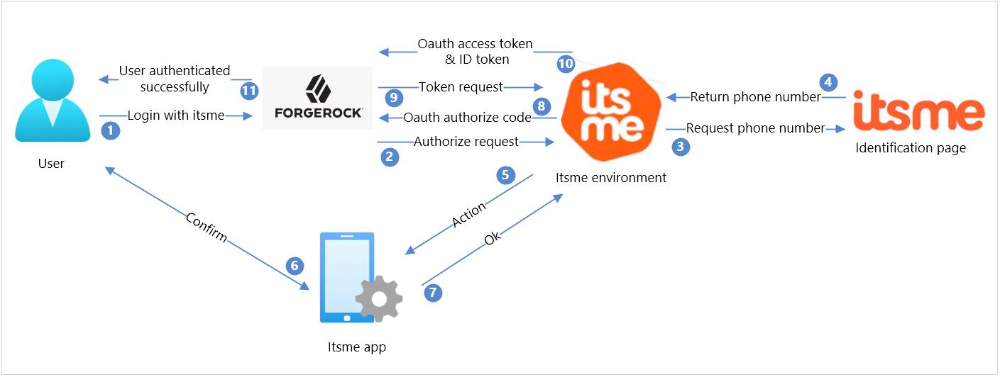

# itsme

The itsme digital ID app allows you to sign in securely without card-readers, passwords,
two-factor authentication, or multiple PIN codes. The itsme app provides strong customer
authentication with a verified identity. In this article, learn how to integrate Forgerock
authentication with itsme OpenID Connect (OIDC) using a client secret user flow policy.

## Onboard with itsme

1. To create an account with itsme, visit itsme at the Forgerock Marketplace
2. Activate your itsme account by sending an email to onboarding@itsme.be. You'll
receive a ClientID and Service code that will be needed for your Forgerock setup.
3. Provide itsme with a public link to your public keys. A tool that can assist you in
building those keypairs can be found here:
https://belgianmobileid.github.io/slate/jose#1-introduction
4. Provide itsme with your redirectURI you will be redirecting the user to after he/she
has completed the transaction in the app.

## Prerequisites

This integration relies on the ForgeRock Social Provider Handler Node which is available in
ForgeRock Platform 7 and assumes integration between AM and IDM has been configured.

* A forgerock account/subscription. If you don't have a subscription, you can get an account here (insert Forgerock link)
* A forgerock tenant that is linked to your forgerock subscription.
* Your Client ID, also known as Partner code, provided by itsme.
* Your Service code provided by itsme.
* Your client secret for your itsme account.

## Scenario

1. On your website or application, include the Log in with itsme button by adapting in
the Forgerock user flow. The interaction flow starts when the user clicks on this
button.
2. Forgerock starts the OpenID connect flow by sending an Authorize request to the
itsme client secret API. A well-known/OpenID-configuration endpoint is available
containing information about the endpoints.
3. The itsme environment redirects the user to the itsme identify yourself page, allowing
the user to fill in their phone number.
4. The itsme environment receives the phone number from the user and validates the
correctness.
5. If the phone number belongs to an active itsme user, an Action is created for the
itsme app.
6. The user opens the itsme app, checks the request, and confirms the action.
7. The app informs the itsme environment the action has been confirmed.
8. The itsme environment returns the OAuth authorize code to Forgerock.
9. Using the authorization code, Forgerock makes a token request.
10. The itsme environment checks the token request, and if still valid, returns the OAuth
access token and the ID token containing the requested user information.
11. Finally, the user is redirected to the redirect URL as an authenticated user.

## Configuration between Forgerock and itsme
### Step 1: Setup itsme to ForgeRock AM
1. Log in to the forgerock Identity cloud
2. Go to “native consoles” > “access management”
3. Go to “services” > “social identity provider service” > “secondary configuration”
4. Select itsme
5. Populate the details with the parameters you got from itsme:
(NOTE: forgerock automatically populates these fields with our production endpoints.
Initially, these need to be changed to our E2E endpoints in order to function.)

| Parameter | Value |
| --- | --- |
| ClientID | Your **Client ID**, also known as **Partner code** |
| Client Secret | Your **client_secret** |
| Authentication Endpoint URL | "https://idp.e2e.itsme.services/v2/authorization" |
| Token Endpoint | "https://idp.e2e.itsme.services/v2/token" |
| User Profile Service URL | "https://idp.e2e.itsme.services/v2/userinfo" |
| RedirectURI | your redirectURI  _**NOTE:** for itsme to function in production, the Forgerock tenant needs to be installed with a custom domain and an OV Cert. Please contact Forgerock support to make sure this is installed on your tenant._ |
| OAuth Scopes | openid profile email service:YOURSERVICECODE |
| Client Authentication Method | _ENCRYPTED_PRIVATE_KEY_JWT_ |
| PKCE method | S256 |
| Request Parameter JWT Option | _NONE_ |
| ACR Values | N/A |
| Well Known Endpoint | _https://idp.e2e.itsme.services/v2/.well-known/openid-configuration_ |
| Request Object Audience | "https://idp.e2e.itsme.services/v2/authorization" |
| Issuer | https://idp.e2e.itsme.services/V2/jwkSet |

All other fields can be left on the default settings from Forgerock.

6. Select ‘itsme profile normalization’ in the transform script drop-down menu.

### Step 2: Define your itsme journey

Go to Journeys and select itsme to build your workflow. There is already a custom flow ready
for you to use with itsme. By default, it includes a username/password flow with itsme added
as a secondary option, but this can be adapted as you wish.
