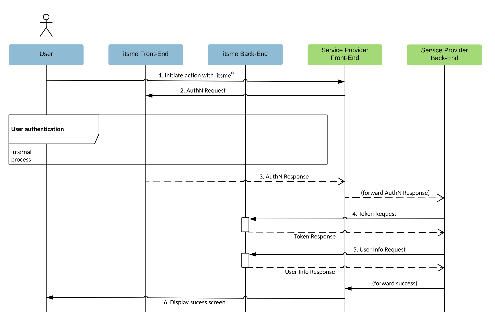

# Overview

Our itsme® app can be seamlessly be integrated with your web desktop, mobile web or mobile application so you can perform secure identity checks.

The diagram below describes the **Authentication** process and how your backend is integrated within the itsme® architecture :
  
 

<ol>
  <li>The User indicates on your end he wishes to authenticate with itsme®</li>
  <li>Your web desktop, mobile web or mobile application (aka 'Relying Party' in the OpenID Connect specification) sends a request to itsme® (aka 'OpenID Provider' in the OpenID Connect specification) to authenticate the User. This request will redirect the User to the itsme® Front-End. itsme® then authenticates the User by asking him
    <ul type>
      <li>to enter his phone number on the itsme® OpenID web page</li>
      <li>authorize the release of some information’s to your application</li>
      <li>to provide his credentials (itsme® code or fingerprint or FaceID)</li>
    </ul>
  
  If you are building a mobile web or mobile application, the User don’t need to enter his mobile phone number on the itsme® OpenID web page, he will be automatically redirected to the itsme app via the Universal links or App links mechanism.</li>
  <li>Once the User has authorized the request and has been authenticated, itsme® will return an Authorization Code to the Service Provider Front-End, redirecting the user to your mobile or web application.</li>
  <li>The Service Provider Back-End calls the itsme® Token Endpoint and exchanges the Authorization Code for an ID Token identifying the User and an Access Token.</li>
  <li>The Service Provider Back-End MAY request the additional User information from the itsme® userInfo Endpoint by presenting the Access Token obtained in the previous step.</li>
  <li>At this stage you are able to confirm the success of the operation and display a success message.</li>
</ol>

If a user doesn't have the itsme® app, they'll be redirected to a mobile website with more information and download links.

# itsme® OpenID Provider configuration

To simplify implementations and increase flexibility, <a href="https://openid.net/specs/openid-connect-discovery-1_0.html" target="blank">OpenID Connect allows the use of a Discovery Document</a>, a JSON document containing key-value pairs which provide details about itsme® configuration, such as the URIs of the 

<ul>
  <li>Authorization, Token and userInfo Endpoints</li>
  <li>supported claims</li>
  <li>JWKSet URL</li>
  <li>...</li>
</ul>

The Discovery document for itsme® can be retrieved from: 

Environment | URL
:-------- | :--------
**SANDBOX** | <a href="https://idp.e2e.itsme.services/v2/.well-known/openid-configuration" target="blank">https://idp.e2e.itsme.services/v2/.well-known/openid-configuration</a>
**PRODUCTION** | <a href="https://idp.prd.itsme.services/v2/.well-known/openid-configuration" target="blank">https://idp.prd.itsme.services/v2/.well-known/openid-configuration</a>

# Generate itsme® button

First, you will need to create a button to allow your users to authenticate with itsme®. See the <a href="https://brand.belgianmobileid.be/d/CX5YsAKEmVI7/documentation#/ux/buttons-1518207548" target="blank">Button design guide</a> before you start the integration. 

Upon clicking this button, we will open a modal view which contains a field that need to be filled by the end user with it’s phone number. Note that mobile web users will skip the phone number step, as they use the itsme® mobile app directly to authenticate.

# API reference

## Create Authorization Request

<b><code>GET https://idp.<i>[e2e/prd]</i>.itsme.services/v2/authorization</code></b>

### Parameters

<table>
  <tbody>
    <tr>
      <td></td>
      <td>It identifies the client. This parameter value is generated during registration.</td>
    </tr>
     <tr>
      <td></td>
      <td>This defines the processing flow to be used when forming the response. Because itsme® uses the Authorization Code Flow, this value MUST be <code>code</code>.</td>
    </tr>
    <tr>
      <td></td>
      <td>
        It allows the application to express the desired scope of the access request. Each scope returns a set of user attributes. The scopes an application should request depend on which user attributes the application needs. Once the user authorizes the requested scopes, his details are returned in an ID Token and are also available through the UserInfo Endpoint.  All scope values must be space-separated.  The basic (and required) scopes is <code>openid</code> and <code>service</code>. Beyond that, your application can ask for additional standard scopes values which map to sets of related claims : <code>profile</code> <code>email</code> <code>address</code> <code>phone</code> 
        <table>
          <tr>
            <td></td><td>It indicates the itsme® service your application intends to use, e.g. <code>service:TEST_code</code> by replacing "TEST_code" with the service code generated during registration.</td>
          </tr>
          <tr>
            <td></td><td>It indicates that your application intends to use the OpenID Connect protocol to verify a user's identity by returning a <code>sub</code> claim which represents a unique identifier for the authenticated user.</td>
          </tr>
          <tr>
            <td></td><td>Returns claims that represent basic profile information, including <code>family_name</code>, <code>given_name</code>, <code>name</code>, <code>gender</code> and <code>birthdate</code>.</td>
          </tr>
          <tr>
            <td></td><td>Returns the <code>email</code> claim, which contains the user's email address, and <code>email_verified</code>, which is a boolean indicating whether the email address was verified by the user.</td>
          </tr>
          <tr>
            <td></td><td>Returns the information about the user's postal address. The value of the address member is a JSON structure containing some or all of these members <code>formatted</code> <code>street_address</code> <code>postal_code</code> <code>locality</code> <code>country</code></td>
          </tr> 
          <tr>
            <td></td><td>Returns the <code>phone</code> claim, which contains the user's phone number, and <code>phone_number_verified</code>, which is a boolean indicating whether the phone number was verified by the user.</td>
          </tr> 
        </table>
      </td>
    </tr>
    <tr>
      <td></td>
      <td>It is the URL to which users are redirected once the authentication is complete. It MUST match the value preregistered during the registration and use the HTTPS scheme. http://localhost is only permitted for development purposes, it’s not for use in production.  <b>Note</b> : make sure that your redirect URIs support the Universal links and App links mechanism. Functionally, it will allow you to have only one single link that will either open your desktop web application, your mobile app or your mobile site on the User’s device. Universal links and App links are standard web links (http://mydomain.com) that point to both a web page and a piece of content inside an app. When a Universal Link is opened, the app OS checks to see if any installed app is registered for that domain. If so, the app is launched immediately without ever loading the web page. If not, the web URL is loaded into the webbrowser.</td>
    </tr>
    <tr>
      <td></td>
      <td>Specifies any string value that your application uses to maintain state between your Authorization Request and the Authorization Server's response. You can use this parameter for several purposes, such as directing the user to the correct resource in your application and mitigating cross-site request forgery. Since your redirect_uri can be guessed, using a state value can increase your assurance that an incoming connection is the result of an authentication request. If you generate a random string or encode the hash of a cookie or another value that captures the client's state, you can validate the response to additionally ensure that the request and response originated in the same browser, providing protection against attacks such as cross-site request forgery.</td>
    </tr>
    <tr>
      <td></td>
      <td>A string value used to associate a session with an ID Token, and to mitigate replay attacks. The value is passed through unmodified from the Authentication Request to the ID Token.</td>
    </tr>
    <tr>
      <td></td>
      <td>If your application knows which user is trying to authenticate, it can use this parameter to pre-fill the phone number of the user on the itsme® sign-in page, e.g. <code>32+123456789</code> with <code>32</code> the country code and <code>123456789</code> the user's phone number.</td>
    </tr>
    <tr>
      <td></td>
      <td>Indicates the user's preferred languages for the itsme® sign-in page, represented as a space-separated list of language tag values, ordered by preference.  Possible values : <code>fr</code> <code>nl</code> <code>de</code> <code>en</code></td>
    </tr>
    <tr>
      <td></td>
      <td>Specify how the itsme® sign-in page should be displayed to the user. If set to <code>touch</code>, it SHOULD displays the itsme® sign-in page with a device that leverages a touch interface. If set to <code>page</code>, the itsme® sign-in UI SHOULD be consistent with a full page view of the User-Agent. If the <code>display</code> parameter is not specified, this is the default display mode.</td>
    </tr>
    <tr>
      <td></td>
      <td>Indicates the authentication method required to process the request, represented as a space-separated list of tag values, ordered by preference.  Possible values : <code>http://itsme.services/v2/claim/acr_basic</code> <code>http://itsme.services/v2/claim/acr_advanced</code>  <b>Note</b> : If these two values are provided only the most constraining authentication method will be applied, e.g. <code>http://itsme.services/v2/claim/acr_advanced</code>. 
        <table>
          <tr>
            <td></td><td>It lets the user to choose either fingerprint usage (if device is compatible) or itsme® code. If the <code>display</code> parameter is not specified, this is the default authentication method.</td>
          </tr>
          <tr>
            <td></td><td>It forces the user to use his itsme® code.</td>
          </tr>
        </table>
      </td>
    </tr>
    <tr>
      <td></td>
      <td>Requests that specific user's details be returned from the UserInfo Endpoint and/or in the ID Token. It is represented as a JSON object that has two members - <code>{"userinfo":{...}</code> and <code>{"id_token":{...}</code>, which content indicates which claims to return at the UserInfo Endpoint and which with the ID Token, together with indication whether the claim is voluntary (default) or essential.  Possible user's details your application can request is listed below. 
        <table>
          <tr>
            <td></td><td>User's full name in displayable form including all name parts, possibly including titles and suffixes</td>
          </tr>
          <tr>
            <td></td><td>Given name(s) or first name(s) of the user. Note that in some cultures, people can have multiple given names; all can be present, with the names being separated by space characters.</td>
          </tr>
          <tr>
            <td></td><td>Surname(s) or last name(s) of the user. Note that in some cultures, people can have multiple family names or no family name; all can be present, with the names being separated by space characters.</td>
          </tr> 
          <tr>
            <td></td><td>User's birthday, represented as a YYYY-MM-DD format.</td>
          </tr> 
          <tr>
            <td></td><td>User's birthday, represented as a string.</td>
          </tr> 
          <tr>
            <td></td><td>User's gender. Possible values are : <code>F</code> <code>M</code></td>
          </tr> 
          <tr>
            <td></td><td>User's email address.</td>
          </tr> 
          <tr>
            <td></td><td><code>true</code> if the user's e-mail address is verified; otherwise <code>false</code>.</td>
          </tr> 
          <tr>
            <td></td><td>User's phone number, in <a href="https://en.wikipedia.org/wiki/E.164" target="blank">E.164</a> format.</td>
          </tr> 
          <tr>
            <td></td><td><code>true</code> if the user's e-phone number is verified; otherwise <code>false</code>.</td>
          </tr> 
          <tr>
            <td></td><td>Returns the information about the user's postal address. The value of the address is a JSON structure containing some or all of these members <code>formatted</code> <code>street_address</code> <code>postal_code</code> <code>locality</code> <code>country</code>.</td>
          </tr> 
          <tr>
            <td></td><td>The jurisdiction that has conferred citizenship rights to the user, in <a href="https://en.wikipedia.org/wiki/ISO_3166" target="blank">ISO 3166</a> format.</td>
          </tr> 
           <tr>
            <td></td><td>The location where the user was born. The value of this attribute is a JSON structure containing some or all of these members <code>formatted</code> <code>city</code> <code>country</code>.</td>
          </tr> 
          <tr>
            <td></td><td>XXX</td>
          </tr> 
          <tr>
            <td></td><td>Returns the Belgian ID card number, 12 digits in the form xxx-xxxxxxx-yy. The check-number yy is the remainder of the division of xxxxxxxxxx by 97.</td>
          </tr> 
          <tr>
            <td></td><td>Returns information about the user's phone. The value of this attribute is a JSON structure containing some or all of these members <code>os</code> <code>appName</code> <code>appRelease</code> <code>deviceLabel</code> <code>debugEnabled</code> <code>deviceID</code>	<code>osRelease</code> <code>manufacturer</code> <code>hasSimEnabled</code>	<code>deviceLockLevel</code> <code>smsEnabled</code> <code>rooted</code> <code>imei</code> <code>deviceModel</code>	<code>sdkRelease</code>.</td>
          </tr> 
          <tr>
            <td></td><td>Returns information about the itsme® transaction. The value of this attribute is a JSON structure containing some or all of these members <code>securityLevel</code> <code>bindLevel</code> <code>appRelease</code>.</td>
           </tr> 
           <tr>
            <td></td><td>Returns an unique identification number of natural persons who are registered in Belgium. This number consists of 11 digits of the form yy.mm.dd-xxx.cd where yy.mm.dd is the birthdate of the person, xxx a sequential number (odd for males and even for females) and cd a check-digit.</td>
          </tr> 
          <tr>
            <td></td><td>Returns an unique identification number of natural persons who are registered via Luxtrust. This number consists of 20 digits.</td>
          </tr> 
          <tr>
            <td></td><td>Returns the citizen service number, a unique registration number for everyone who lives in the Netherlands. This number consists of 8 to 9 digits.</td>
          </tr> 
        </table>
      </td>
    </tr>
    <tr>
      <td></td>
      <td>A URL using the https scheme referencing a resource containing a JWT whose claims are the request parameters. The <code>request_uri</code> parameter is used to secure parameters in the authentication request from tainting or inspection when sending the request to the itsme® Authorization Endpoint.  If used, the JWT MUST be signed then encrypted, with the result being a Nested JWT.</td>
    </tr>
    <tr>
      <td></td>
      <td>It represents the request as a JWT whose Claims are the request parameters. The <code>request</code> parameter is used to secure parameters in the authentication request from tainting or inspection when sending the request to the itsme® Authorization Endpoint.  If used, the JWT MUST be signed then encrypted, with the result being a Nested JWT.</td>
    </tr>
  </tbody>
</table>

### Response

<code>200</code> <code>application/json</code>

<table>
  <tbody>
    <tr>
      <td></td>
      <td>An intermediate opaque credential used to retrieve the ID Token and Access Token.  <b>Note</b> : the code has a lifetime of 3 minutes.</td>
    </tr>
    <tr>
      <td></td>
      <td>The string value provided in the Authorization Request. You SHOULD validate that the value returned matches the one supplied.</td>
    </tr>
  </tbody>
</table>

### Example

**Request**

**Response**

## Build Token Request

<b><code>POST https://idp.<i>[e2e/prd]</i>.itsme.services/v2/token</code></b>

To asserts the identity of the user, the <code>code</code> received previously need to be exchanged for an ID Token and Access Token. During this step, your application has to authenticate itself to our server using RSA keys. 

### Parameters

<table>
  <tbody>
    <tr>
      <td></td>
      <td>Set this to <code>authorization_code</code> to tell the Token Endpoint that the application wants to exchange an authorization code for an ID koken and access token. </td>
    </tr>
    <tr>
      <td></td>
      <td>The intermediate opaque credential received in the Authorization Response.</td>
    </tr>
    <tr>
      <td></td>
      <td>It is the URL to which users are redirected once the authentication is complete. It MUST match the value used in the Authorization Request.</td>
    </tr>
    <tr>
      <td></td>
      <td>specifies the type of assertion. Set this to <code>urn:ietf:params:oauth:client-assertion-type:jwt-bearer</code>.</td>
    </tr>
    <tr>
      <td></td>
      <td>Contains a JWT token that is signed, and then encrypted, using the client RSA keys. This ensures that the request to get the id token and access token is made only from the application, and not from a potential attacker that may have intercepted the authorization code.  The JWT contains the following claims.        
        <table>
          <tr>
            <td></td><td>The issuer of the token. This value must be the same as the <code>client_id</code>.</td>
          </tr>
          <tr>
            <td></td><td>The subject of the token. This value must be the same as the <code>client_id</code>.</td>
          </tr>
          <tr>
            <td></td><td>The full URL of the resource you're using the JWT to authenticate to. Set this to <code>https://idp.prd.itsme.services/v2/token</code>.</td>
          </tr>
          <tr>
            <td></td><td>An unique identifier for the token.</td>
          </tr>
          <tr>
            <td></td><td>The expiration time of the token in seconds since January 1, 1970 UTC.</td>
          </tr> 
        </table>
      </td>
    </tr>
  </tbody>
</table>

### Response

<code>200</code> <code>application/json</code>

<table>
  <tbody>
    <tr>
      <td></td>
      <td>An intermediate opaque credential used to retrieve the ID Token.  <b>Note</b> : the code has a lifetime of 3 minutes.</td>
    </tr>
    <tr>
      <td></td>
      <td>The string value provided in the Authorization Request. You SHOULD validate that the value returned matches the one supplied.</td>
    </tr>
  </tbody>
</table>

### Example

**Request**

**Response**

